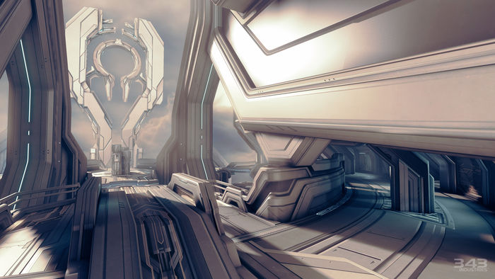
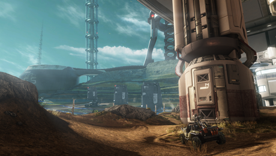
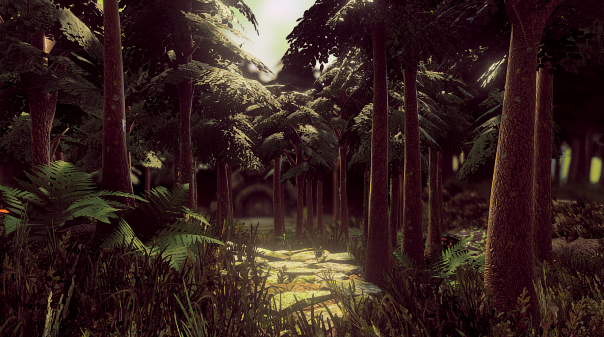

# F-P-S
A modern multiplayer FPS game in your browser.

## FPS5 Documentation
Welcome to FPS5! Scroll down to see more information about the game.

### What is FPS5?
FPS5 is a modern FPS web game based off of Halo 4 and Halo infinite, but with just a hint of FPS feel.
 
FPS5 was built with pure JavaScript, and also supports multiplayer. _[See more about how it was made](./)_

### What does FPS5 include?
- Multiplayer
- Bot functions
- Variety of maps
- Variety of weapons
- Realistic animations
- Realistic armor and skins
- Realistic sound effects
- Custom multiplayer lobby creator

### How can I play?

FPS5 is available publicly at [www.fps5.ml](https://www.fps5.ml)
 
_Note: This game may be a little buggy because it was just released._ If you encounter
 
any bugs, please [report it](https://github.com/Parking-Master/FPS/issues/new) in the "Issues" section (mark as bug) or contact support at fps5@mail.com.

### How it works
FPS5 uses Gametime.js for multiplayer functions, and Gametime.js uses Pubnub which is server-side.
 
Other than that, FPS5 uses pure JavaScript for everything else.

 

## Miscellaneous Items
Maps, Characters, & Weapons are all listed here.

### Maps (Original Halo 4 & FPS5 maps)
<h4 align="center">Haven</h5>
"<i>Resting high above Requiem’s surface, harmonic-resonance platforms appear to facilitate the monitoring and management of the shield world’s solar preservation system. These elaborate machines enable artificial planets to support their immense populations of indigenous life.</i>"

 
<h4 align="center">Harvest</h5>

"<i>Similar to those found on other agrarian worlds, the impressive tether network was used to ferry resources off-planet.</i>"

<h4 align="center">Vertex</h5>
"<i>Nicknamed "The Floating Forest", Vertex ("Vertical Existence") is a iconic map featuring unlimited scenery and hospitality. It is one of the most popular planets in its universe.</i>"

<h4 align="center">Apex</h5>
"<i>Apex ("Alternate Existence") was broken off of planet Vertex after a 100-mile-radius asteroid collided with it, and was forcibly thrown out of the greener part of outer space where Vertex lives. Apex is an alias of Vertex and is a rotting desert in an unknown part of outer space.</i>"

###### <i>Note: More maps may be coming soon</i>
### Characters (Original Halo 4 characters)
<h4 align="center">Mark VI</h5>
The original Halo armor from all halo series (4 to be specific). The Mark-VI default armor is a GEN2 model from the original Mark-V (Halo: CE Armor)

<h4 align="center">FOTUS</h5>
The F.O.T.U.S. Armor (Fist Of The Unicorns) is a metafictional joke character originated Halo 4 multiplayer. The spike on its helmet was based from "Unicorn" in the name.

###### <i>Note: More characters may be coming soon</i>

### Weapons (Original FPS5 weapons)
<h4 align="center">Concept ACE-35R</h5>
The Weapon Concept ACE-35R ("Default Rifle") is a basic 3-round-burst and Semi-Automatic rifle that does average damage to all aiming positions. This rifle is most commonly used in close-quarters and medium-range combats.
 
 
- <b>Damage</b>: 30/100
 
- <b>Accuracy</b>: 40/100
 
- <b>Overall</b>: 3/5

<h4 align="center">G17 9mm Pistol</h5>
The G17 9mm Pistol is the standard pistol that shoots 9mm x 9mm rounds.
 
 
- <b>Damage</b>: 10/100
 
- <b>Accuracy</b>: 10/100
 
- <b>Overall</b>: 2/5

<h4 align="center">HK-G28 Sniper Rifle</h5>
The HK-G28 is a fast and easy weapon to use, but not very mobile. It uses green-tip .50 Cal armor piercing incendiary rounds that can cause 1/2 damage up to 300 yards away.
 
 
- <b>Damage</b>: 50/100
 
- <b>Accuracy</b>: 65/100
 
- <b>Overall</b>: 4/5

<h4 align="center">M16 A2 Assault Rifle</h5>
The M16 A2 Assault variant is a weak weapon with a full auto feature which makes it more powerful. Accuracy is low on full auto mode.
 
 
- <b>Damage</b>: 10/100
 
- <b>Accuracy</b>: 35/100
 
- <b>Overall</b>: 3/5

<h4 align="center">Fully-Automatic UZI</h5>
The UZI is a like a very weak pistol which also has a full auto feature which makes it more powerful. Accuracy is low on full auto mode, and damage is very low.
 
 
- <b>Damage</b>: 6/100
 
- <b>Accuracy</b>: 5/100
 
- <b>Overall</b>: 1/5

<h4 align="center">Remington 870 12 Guage Shotgun</h5>
The Remington 870 is a high-powered 12 guage pump-action shotgun with low accuracy but high damage. It fires birdshot 12 guage shotgun shells.
 
 
- <b>Damage</b>: 36/100
 
- <b>Accuracy</b>: 20/100
 
- <b>Overall</b>: 4/5

###### <i>Note: More weapons may be coming soon</i>

### In-game photos
<!-- 

 -->

### How to play
> ( ᐱ ): Walk forward 
> ( ᐯ ): Walk backward 
> ( ᐸ ): Walk left 
> ( ᐳ ): Walk right 
> ( " " ): Jump 
> ( B ): Melee 
> ( F ): Shoot 
> ( R ): Reload 
> ( T ): Interact 
> ( Y ): Switch Weapon 
> ( ESC ): Cancel 
> ( CURSOR ): Look around 

_(Official documentation at Documentation.md)_

## Support & Contribution
If you enjoyed the project / repository, please help out by submitting feature requests or report bugs in the "Issues" section.

## License
MIT

## Credits
- ["Halo 4 Haven Multiplayer Map"](https://skfb.ly/otBXv) - <small>_by Iso-Didact_ Licensed under Creative Commons Attribution (http://creativecommons.org/licenses/by/4.0/).</small>

- ["Halo 4 Harvest Multiplayer Map](https://skfb.ly/otE7u) - <small>_by Iso-Didact_ Licensed under Creative Commons Attribution (https://creativecommons.org/licenses/by/3.0/).</small>

- ["Weapon Concept ACE-35R"](https://clara.io/view/21c110f9-e28e-4eae-af01-f9572e8f121e) - <small>_by Json Shoumar_ Licensed under Creative Commons Attribution-NonCommercial-ShareAlike (https://creativecommons.org/licenses/by/3.0/).</small>

- ["HK-G28 Sniper Rifle"](https://sketchfab.com/3d-models/hk-g28-sniper-rifle-997840668e1e4c1384c7220563323085) - <small>_by trolosqlfod_ Licensed under Creative Commons Attribution (http://creativecommons.org/licenses/by/4.0/).</small>

- ["G17 9mm Pistol"](https://clara.io/view/945c9bb5-3ecf-4e52-8801-66020bc6c506) - <small>_by HageTag_ Licensed under Creative Commons Attribution-NonCommercial-ShareAlike (https://creativecommons.org/licenses/by/3.0/).</small>

- ["Halo Infinite Master Chief"](https://sketchfab.com/3d-models/9mm-pistol-30222f9a59104426ba526a6b20cd7532) - <small>_by bensimulator2_ Licensed under Creative Commons Attribution (http://creativecommons.org/licenses/by/4.0/).

- ["FPS Pistol Animations"](https://sketchfab.com/3d-models/fps-pistol-animations-0d7a343dcb6f401197a73c91aee93f6d) - <small>_by Cransh_ Licensed under Creative Commons Attribution (http://creativecommons.org/licenses/by/4.0/).

- ["UZI"](https://sketchfab.com/3d-models/uzi-fde60adc8aff4c61b6a8bea1f9e0743f) - <small>_by creationwasteland_ Licensed under Creative Commons Attribution (http://creativecommons.org/licenses/by/4.0/).

- ["M16 A2 Rifle"](https://sketchfab.com/3d-models/m16-a2-rifle-20c4bb925ca349c6b33aca176b8affba) - <small>_by Luchador_ Licensed under Creative Commons Attribution (http://creativecommons.org/licenses/by/4.0/).

- ["Remington 870"](https://sketchfab.com/3d-models/remington-870-police-magnum-12-gauge-shotgun-eea11de7e9d24b6683962b8388c319eb) - <small>_by 8sianDude_ Licensed under Creative Commons Attribution (http://creativecommons.org/licenses/by/4.0/).

- ["Veld Fire"](https://hdrihaven.com/hdri/?h=veld_fire) - <small>_by Greg Zaal_ Licensed under CC0 ("No Rights Reserved") (https://creativecommons.org/share-your-work/public-domain/cc0/).

Did we forget to include something? [Report](https://github.com/Parking-Master/FPS/issues/new)
